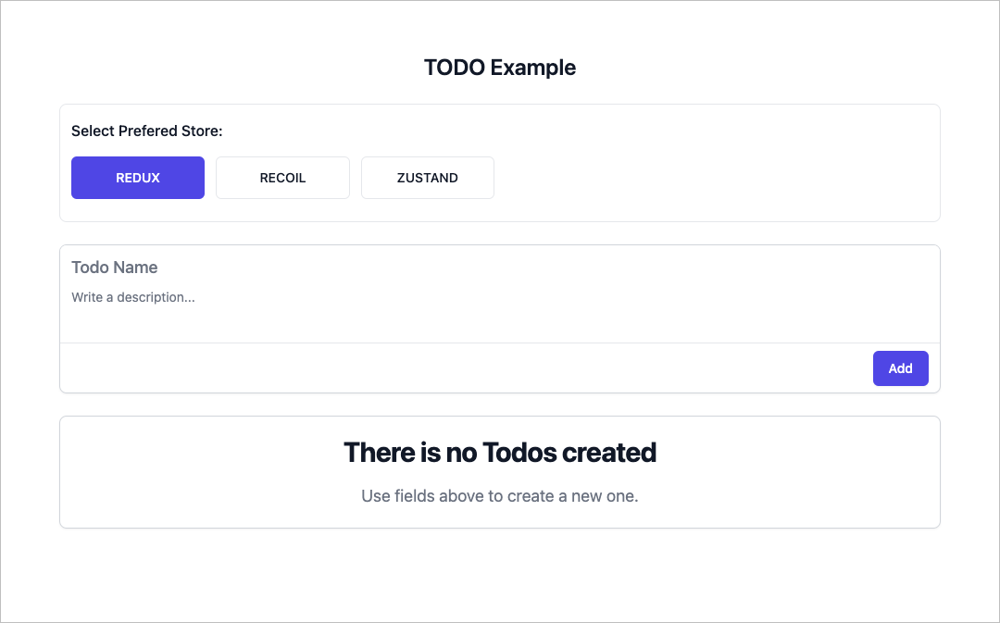

# Abstract store example

This repo show how store could be easily replaced with abstract store layer and using them with dependency injection. **[Live Demo](https://abstract-store.vercel.app/)**.

## Libraries used here

- [tailwind](https://tailwindui.com/)
- [react](https://github.com/facebook/react/)
- [react-obsidian](https://github.com/wix-incubator/react-obsidian)
- [redux](https://github.com/reduxjs/redux)
- [recoil](https://github.com/facebookexperimental/Recoil)
- [zustand](https://github.com/pmndrs/zustand)
